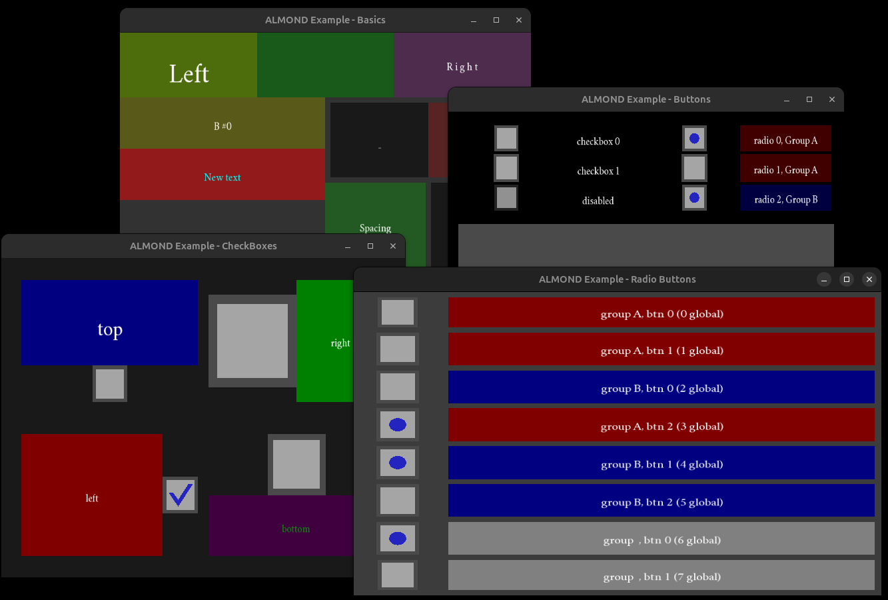

# ALMOND
ALMOND is a framework for GUI applications. It is based on **SFML** and aims to provide a minimalistic and practical approach to adding GUI menus to SFML programs. The structure of the GUI can be declared in a text file with ALMOND's custom format, called `NDG` (stands for *almoND Gui*).



## QuickStart
* Building and running the examples in Linux
```bash
bash scripts/install_dependencies.sh # only the first time an ALMOND/SFML project is used
bash scripts/build.sh
bash scripts/run.sh
```

## Example program
- [Visualizer](https://github.com/DiegoBarMor/VisualizerLinearTransforms) for 3D rotations using 3x3 matrices.


<!-- ****************************************************************************************** MAIN DESCRIPTION -->
## Framework description
### NDG files
These are text files that contain the details on how the GUI should be organized, as well as the characteristics of its components. It allows characterizing of the GUI widgets using only the NDG file, without the need to re-compile for every time the GUI structure or other details are changed. However, linking callbacks can't be achieved using the NDG file, as this requires compiling custom made functions or lambda expressions.

### Widgets and specs
The GUI is formed by a collection of **widgets** that interact with the user and with each other. A widget is capable of building and displaying a **SFML** shape, as well as handling *events* and other forms of behaviour. **Containers** are specialized widgets capable of managing and organizing *children* widgets. This allows the GUI to have a hierarchical structure, starting from a **root** container that holds other widgets and containers.

Widgets are characterized by **specs** (short for *specifications*), which are pieces of data given by the client, either through the NDG file or by accessing through the public interface of the widgets directly. Specs introduced by a widget class carry on in widgets that are derived via inheritance. Other internal characteristics of the widgets, such as position and size, might also be accessible via the widget's public interface.

### The NDGParser class
[TODO]

### The App class
ALMOND works by instantiating an implementation of `nd::App` into the part of the program where SFML window or drawables cohabit.
[TODO] how to construct, how to use...

### Events
[TODO]

### Lifecycle of a Widget: CSABHD
[TODO]
- C: Clone
- S: Set specifications
- A: Add children
- B: Build
- H: Handle events
- D: Draw

### Implementing the App class
[TODO]


<!-- ****************************************************************************************** CLASSES -->
## GUI Class Hierarcy
The following is the class inheritance hierarchy for the widgets.

```
Widget (x)?
|-- Container
|   |-- RowLayout
|   `-- ColumnLayout
|-- Text
|   `-- TextInput
|-- ButtonPrimitive (x)
|   |-- LabeledButton
|   `-- ToggleableButton (x)
|       |-- CheckBox
|       `-- RadioButton
`-- Slider [TODO]
```

Classes that can't be instantiated directly are denoted with a `(x)`.

### About the classes
- `nd::Widget`: Provides a public interface common to any kind of widget. It implements basic GUI behaviour, such as building and displaying a shape and event handling. This allows the `NDGParser` to construct different widgets, containers, etc without the need of knowing what they are, as it just passes construction responsability to `nd::Widget::GUIFactory` in the form of strings, and `nd::Widget` instantiates the widgets by cloning their respective prototype from the static hashtable `nd::Widget::_prototypes`. This table is to be filled out by the `App` (and its implementations) using `nd::Widget::add_prototype` before performing any parsing. The `NDGParser` uses a similar approach with setting `specs`: it passes responsability to the virtual `nd::Widget::set_spec`, which can be overriden by derived classes to accept more kinds of `specs`. `nd::Widget` shouldn't be instantiated directly, so it has no prototype.
- `nd::Container`: Implements the possibility of building and holding other widgets as children. Instantiating `nd::Container` directly provides a container that makes its children overlap by assigning them the same size and position.
- `nd::RowLayout`: This is a more specialized container that space its children horizontally according to their weights.
- `nd::ColumnLayout`: This is a more specialized container that space its children vertically according to their weights.
- `nd::Text`: This widget displays a string of text. All `nd::Text` instances use the same font (it is a static reference).
- `nd::TextInput`: This version of `nd::Text` displays a *hint* when its content string is empty. When a `nd::TextInput` instance is *focused*, its content string can be populated or deleted via user input. The content can be copied/cut/pasted with the standard shortcuts.
- `nd::ButtonPrimitive`: This widget primitive is capable of storing a *click* state, which allows for better handling of click operations. It also changes `bg_color` dinamically according to its *click* state. `nd::ButtonPrimitive` shouldn't be instantiated directly, so it has no prototype.
- `nd::LabeledButton`: This is an implementation of `nd::ButtonPrimitive` that also contains a `nd::Text` member, which allows for buttons with text labels. It passes the unique specs of `nd::Text` to it.
- `nd::ToggleableButton`: This is an implementation of `nd::ButtonPrimitive` that stores a state of *checked* that is toggled every time an `_on_mouse_release` event is handled succesfully. When the widget's *checked* state changes, its display updates automatically, which provides a visual cue of its status (this must be implemented by the children classes). `nd::ToggleableButton` shouldn't be instantiated directly, so it has no prototype.
- `nd::CheckBox`: This kind of `nd::ToggleableButton` implements a basic display that reflects the widget's *checked* status.
- `nd::RadioButton`: This is a kind of `nd::ToggleableButton` where different instances of `nd::RadioButton` get grouped together according by their *group_id* spec. For any given group, exactly one `nd::RadioButton` instance needs to be *checked*: toggling on another instance in the group will toggle off the previously *checked* one, and trying to directly toggle off the *checked* one will not succeed.

### About the specs
[TODO]
- `id`:
- `weight`:
- `bg_color`:
- `padding`:
- `spacing`:
- `text_str`:
- `font_size`:
- `font_color`:
- `hint`:
- `hint_color`:
- `bg_idle`:
- `bg_hover`:
- `bg_pressed`:
- `checked`:
- `color_mark`:
- `outline_thickness`:
- `group_id`:

<!-- ****************************************************************************************** NDG FORMAT -->
## NDG format specification
A widget's `type` is specified first, followed by the `spec=value` pairs in parentheses. If it has children, they are enclosed in `{}`.

```
type (spec=value; spec=value; ...) { # an inline comment
    child_type (spec=value; spec=value; ...)
    child_type (spec=value; spec=value; ...) {
        ...
    }
    ...
}
```

### General considerations
- Whitespaces are ignored. Linebreaks and indentations are just cosmetic.
- `types`, and `spec=value` pairs are case-insensitive (except for the content of text values).
- `spec=value` are separated with semicolons (`;`). Ending the last `spec=value` pair of a widget with semicolon is optional.
- If used, `{}` must have at least one child widget.
- If an `id` is provided, the widget will be registered in the static `nd::Widget::_table_id_widgets` hashmap.
- The `specs` introduced by one class carry on in whoever inherits from it.

#### Convenience features
- `()` can be left empty. E.g. `box(w=1)` is equivalent to `box()`. The `spec=value` pairs will be set to default values.
- *spacing* can be added by simply using `()`, omitting both `type` and `spec=value` pairs. This is because `()` is equivalent to `generic()`, which referes to a default Widget.
- `()` can be omitted if the `type` is specified and `{}` is used to define children. E.g. `row { box() box() }` is equivalent to `row() { box() box() }`

### Standard datatype representations for the `spec` values
- **boolean**: can be set to true by providing either `TRUE`, `T` or `1` (case insensitive). Any other value will set the boolean to false.
- **float**: composed by digits in the range `0-9`, with a dot `.` to indicate the decimal position.
- **ratio**: consists of a float with a value in the range `0.0-1.0`. If a value outside this range is provided, it gets truncated to the closest boundary.
- **string**: text value surrounded by `""`. The `""` can be skipped if the string doesn't contain character such as `(){};=#`, with the additional consequence that whitespaces will be ignored and the content set to uppercase (basically the parser just treat is as a generic *raw value*).
- **color**: color value of the format `r,g,b,a`, where *r*,*g*,*b* and *a* are integers in the range `0-255`. If *a* is ommited, the default value `255` is assumed for it.

### Accepted widget `type`s
| NDG keyword   | NDG Alias | Widget Class       |
|---------------|-----------|--------------------|
| `space`       | ` `       | `nd::Widget`       |
| `container`   | `box`     | `nd::Container`    |
| `layoutrow`   | `row`     | `nd::RowLayout`    |
| `layoutcol`   | `col`     | `nd::ColumnLayout` |
| `text`        | `txt`     | `nd::Text`         |
| `textinput`   | `tin`     | `nd::TextInput`    |
| `button`      | `btt`     | `nd::Button`       |
| `checkbox`    | `cbx`     | `nd::CheckBox`     |
| `radiobutton` | `rbn`     | `nd::RadioButton`  |

### Accepted `spec`s
| NDG keyword         | NDG Alias | Type    | Default Value     | Field name          | Introduced by          |
|---------------------|-----------|---------|-------------------|---------------------|------------------------|
| `identifier`        | `id`      | string  | ` `               | `id`                | `nd::Widget`           |
| `weight`            | `w`       | float   | `1.0`             | `weight`            | `nd::Widget`           |
| `bg_color`          | `bg`      | color   | `0,0,0,255`       | `bg_color`          | `nd::Widget`           |
| `padding`           | `p`       | float   | `0.0`             | `padding`           | `nd::Container`        |
| `spacing`           | `s`       | float   | `0.0`             | `spacing`           | `nd::Container`        |
| `text`              | `t`       | string  | ` `               | `text_str`          | `nd::Text`             |
| `font_size`         | `fs`      | float   | `20.0`            | `font_size`         | `nd::Text`             |
| `font_color`        | `fc`      | color   | `255,255,255,255` | `font_color`        | `nd::Text`             |
| `hint`              | `h`       | string  | ` `               | `hint_str`          | `nd::TextInput`        |
| `hint_color`        | `hc`      | color   | `100,100,100,255` | `hint_color`        | `nd::TextInput`        |
| `enabled`           | `e`       | boolean | `false`           | N/A                 | `nd::ButtonPrimitive`  |
| `bg_idle`           | `bgi`     | color   | `0,0,0,255`       | `bg_idle`           | `nd::ButtonPrimitive`  |
| `bg_hover`          | `bgh`     | color   | `0,0,0,255`       | `bg_hover`          | `nd::ButtonPrimitive`  |
| `bg_pressed`        | `bgp`     | color   | `0,0,0,255`       | `bg_pressed`        | `nd::ButtonPrimitive`  |
| `bg_disabled`       | `bgd`     | color   | `0,0,0,255`       | `bg_disabled`       | `nd::ButtonPrimitive`  |
| `checked`           | `chk`     | boolean | `false`           | `checked`           | `nd::ToggleableButton` |
| `color_mark`        | `fgm`     | color   | `0,0,200,200`     | `color_mark`        | `nd::ToggleableButton` |
| `outline_thickness` | `oth`     | ratio   | `0.2`             | `outline_thickness` | `nd::ToggleableButton` |
| `group`             | `grp`     | string  | ` `               | `group_id`          | `nd::RadioButton`      |


<!-- ****************************************************************************************** TODO -->
## TODO
### Priority
- Migrate properly from SFML 2.5.1 to 3.0.0
- Replace raw pointers with smart pointers
- Reorganize the repo

### Implementations / Improvements
- Implement more widget types:
    - `nd::Slider`.
    - `nd::GridLayout`.
    - `nd::ScrollLayout`.
    - `nd::Draggable`.
- Polish the event handling (e.g. prioritize overriding internal callback wrappers instead of overriding handle_event).
- Improve the `nd::TextInput`
    - Add cursor, capable of moving around when using the arrows and selecting sections of text. Clipboard operations should behave differently when a selection is active.
    - Add spec to enable or disable multiline.
- Define a small `nd::RectShapeOverlay` class (not a widget) that can be used by `nd::CheckBox`, `nd::RadioButton` and `nd::TextInput`.
- Add a global resource for assigning default colors to the widgets, instead of hardcoding them in every class.
- Add possibility to escape characters in a text spec.
- Add possibility to swap out widgets (including the root) at runtime, either by giving the reference to an existing object, or by parsing it from a `NDG` file.
    - Implement appropriate destructors, for when widgets are removed.
    - Consider using a linked list approach instead of the RadioButtonGroup structs. This will allow for better managing when adding/deleting radiobuttons.
- Implement text alignment spec for `nd::Text`
- Allow to specify vertical and horizontal padding separately.
- Implement ALMOND as a [library](https://learn.microsoft.com/en-us/cpp/build/walkthrough-creating-and-using-a-dynamic-link-library-cpp?view=msvc-170).

### Issues
- Fix the click detection after the window changes shape/size.
- Check why `nd::Text` instances with larger font sizes don't align properly their `sf::Text` field.
- Fix implementation issue where buttons can be activated by pressing click outside and then simply releasing it inside its boundaries.
- Fix button not changing color from hover to idle state if the mouse gets into another window.
- Check why widgets square-forced widgets in a container are sometimes smaller at the ends of the container.
- Allow empty containers (instead of breaking the parser).

### Documentation
- Document the event types and the event management.
- Document properly the lifecycle of the App instances: init, create, build...
- Document the specs.


<!-- ****************************************************************************************** -->
